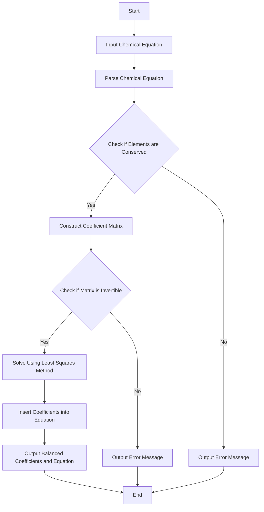

# AToCE
[中文版本](README_zh.md)
##### Automatic Balancing of Chemical Equations

##### This code is designed to balance chemical equations and output the balanced coefficients and equations.

##### Users are required to input a chemical equation, for example: Fe2(SO4)3 + NH4OH = Fe(OH)3 + (NH4)2SO4.

##### The code will parse the equation and use linear algebra methods to find the balancing coefficients.

##### Finally, the code will output the balanced chemical equation.

##### Of course, this program will also check whether the input chemical equation is compliant.

##### Version 1.3 update, optimized the validate function, only retaining the code corresponding to the check of element conservation, and the remaining checks use the method of whether the least squares method can output results.

# Version 1.3 Flowchart


# Constructing the Indeterminate Equation for the Related Chemical Equation
For a chemical equation of the form:
$${\textstyle \sum_{i=1}^{n}x_{i}A_{i}(p)}=  {\textstyle \sum_{j=1}^{m}y_{j}B_{j}(q)} (*)$$
$where A_{i}(p),B_{j}(q)represent the chemical formulas, and x_{i},y_{j} are the coefficients.$for the chemical equation(*), we might construct the following matrix:
$$Matrix(A)=\begin{bmatrix}
 \left | A_{11} \right |  & \cdot \cdot \cdot & \left | A_{1n} \right |  & -\left|B_{11}\right | & \cdot \cdot \cdot  & -\left|B_{1m}\right |\\
 \left | A_{21} \right |& \cdot \cdot \cdot & \cdot \cdot \cdot  & \cdot \cdot \cdot & \cdot \cdot \cdot &  -\left|B_{2m}\right | \\
\cdot \cdot \cdot &&&&&\cdot \cdot \cdot \\
 \left | A_{(c-1)1} \right | & \cdot \cdot \cdot & \cdot \cdot \cdot  & \cdot \cdot \cdot  & \cdot \cdot \cdot &  -\left|B_{(c-1)m}\right | \\
 \left | A_{c1} \right |  & \cdot \cdot \cdot & \left | A_{cn} \right |  & -\left|B_{c1}\right | & \cdot \cdot \cdot  & -\left|B_{cm}\right |
\end{bmatrix}$$
 $In the equation, \(\left|Q_{ij}\right|\) represents the number of occurrences of the \(i\)-th element that has appeared in the chemical formula \(Q()\), where \(i\) represents the sequence of elements that have appeared in the chemical equation (*), and \(j\) represents the sequence of compounds in the chemical equation (*).$
 and
$$Matrix(B)=\begin{bmatrix}
 0\\
 \cdot \\
 \cdot \\
 \cdot \\
0
\end{bmatrix},Matrix(x)=\begin{bmatrix}
 x_{1}\\
 \cdot \\
 x_{n} \\
 y_{1} \\
\cdot \\
y_{m}
\end{bmatrix}$$
Thus, solving the indeterminate equation Matrix(**A**)Matrix(*x*)=Matrix(**B**) is possible. It should be noted that in this indeterminate equation, the constant matrix **B** is all zeros, and fitting with the least squares method will result in **A** being a zero vector. Therefore, it is necessary to first find the column with the fewest non-zero occurrences in the coefficient matrix **A** and move it to the constant matrix **B**, so that the indeterminate equation can be solved using the least squares method.

For example, the coefficient matrix **A** for the chemical equation $x_{1}CH_{3}COOH=x_{2}CO_{2}+x_{3}H_{2}O$ is:
$\begin{bmatrix}'C': & 2 & -1 & 0\\'H': & 4 & 0  & -2\\'O': & 2 & -2 & -1\end{bmatrix}$
(Note: The 'C', 'H', and 'O' are for demonstration purposes only.)

At this point, we extract the first column to form the new coefficient matrix  **A**:
$\begin{bmatrix}   -1 & 0\\ 0 & -2\\  -2 & -1\end{bmatrix}$.
The constant matrix **B** is:
$\begin{bmatrix} -2\\-4\\-2\end{bmatrix}$.
Now, we can proceed with the calculation.

### Feature List

```markdown
## To-Do List

- [ ] Automatically balance ionic reaction equations
  - [ ] Recognize superscript symbols on the top right
  - [ ] Include in balancing calculations or directly balance and then check
- [ ] Allow multiple inputs and balance

## Completed
- [x] Recognize basic chemical equations
- [x] Implement balancing logic algorithm
- [x] Recognize parentheses () and include in calculations
- [x] Writing check
```

### Usage

**In a Python environment:** Run the script at the path `.../AToCE-1.3.py`

**Without a Python environment:** Use the executable file located at `.../dist/AToCE-1.3.exe`
