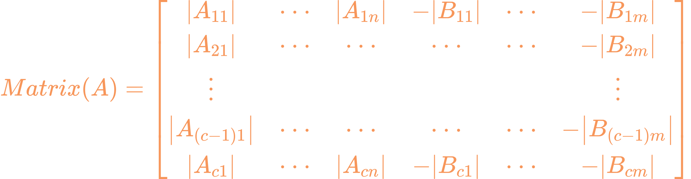
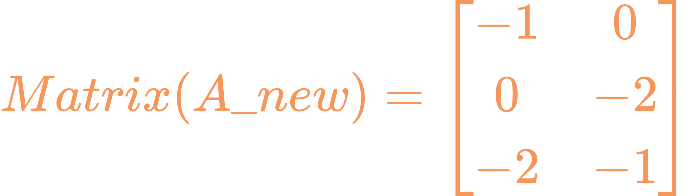

# AToCE
[中文版本](README_zh.md)
### Automatic Trim of Chemical Equations

#### Users need to input a chemical equation, for example: Fe2(SO4)3+NH4OH=Fe(OH)3+(NH4)2SO4.

### Version 1.5 Update: Recognize and balance ionic equations

# Version 1.5 Flowchart


# Constructing Indeterminate Equations for Chemical Equations
For a chemical equation of the form:

<br>$Where\ A_{i}(p), B_{j}(q)\ represent \ chemical \ formulas, x_{i}, y_{j} \ are \ coefficients \ for \ the chemical \ equation (*)$
We might construct the following matrix:
  
Where  represents the number of times the ith element that has appeared in the chemical formula , i represents the order of elements that have appeared in the chemical equation (\*), and j represents the order of compounds in the chemical equation (*).
And:
.svg) 
Thus, solving the indeterminate equation Matrix(**A**)Matrix(*x*)=Matrix(**B**) is possible. It should be noted that in this indeterminate equation, the constant matrix **B** is all zeros, and fitting with the least squares method will result in x being a zero vector. Therefore, it is necessary to first find the column with the fewest non-zero occurrences in the coefficient matrix **A**, move it to the constant matrix **B**, so that the indeterminate equation can be solved using the least squares method.

For example, the coefficient matrix **A** for the chemical equation
is:  (The colon in front is for demonstration only)
At this time, extracting the first column gives the coefficient matrix  and the constant matrix , which can then be operated on.

# Features

```markdown
## To-Do List

- [ ] Standardize the recognition of {-} or {+} symbols
- [ ] Balance chemical equations that have already been given several coefficients
- [ ] Balance electrode reaction equations
- [ ] Recognize and balance ionic reaction equations
  - [ ] Recognize the electron 'e' symbol
  - [ ] Include in calculations
## Completed
- [x] Recognize basic chemical equations
- [x] Implement balancing logic algorithm
- [x] Recognize () and include in calculation
- [x] Writing check
- [x] Multiple inputs and balancing
- [x] Automatically balance ionic reaction equations
  - [x] Recognize superscript symbols on the upper right
  - [x] Include in balancing calculation 
```

# Usage
Run the [AToCE-1.4.py](./AToCE-1.4.py) file in the Python environment.  
Run the [AToCE-1.4.exe](./dist/AToCE-1.4.exe) file in environments without Python.
