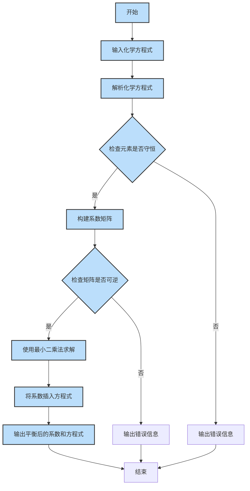
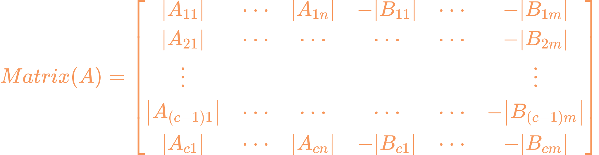
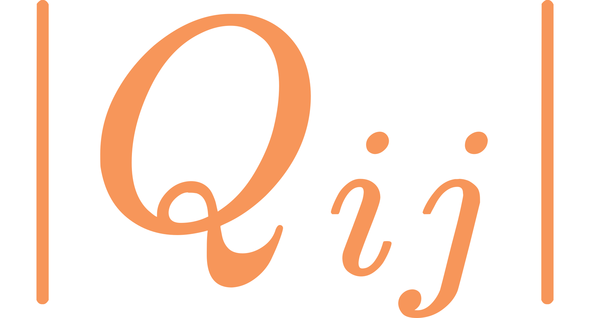
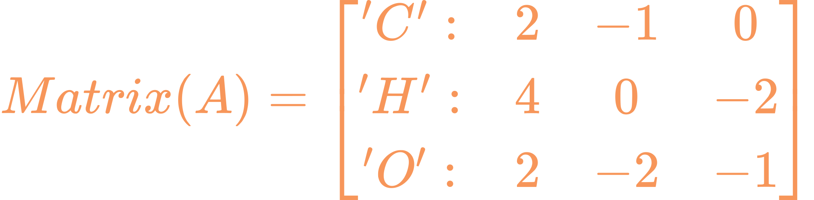
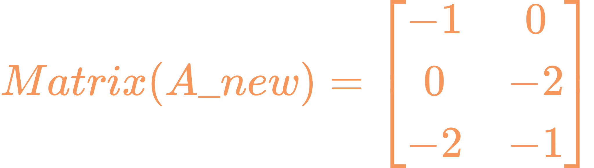
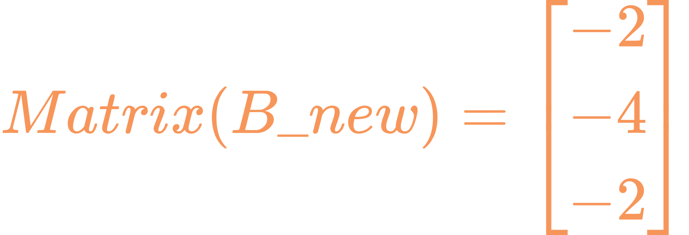

# AToCE
[English Version](README_en.md)
#### 自动配平化学方程式Automatic Trim of Chemical Equations

##### 用户需要输入一个化学方程式，例如：Fe2(SO4)3+NH4OH=Fe(OH)3+(NH4)2SO4。

#### 1.4版本更新：完善了用户多次输入方程式的功能，并修复了部分bug。


# 1.4版本流程图



# 构建相关化学方程式的不定方程
对于一个形如：    
$其中A_{i}(p),B_{j}(q)代表化学式，x_{i},y_{j} 为系数的化学方程式(*)$  
不妨构建以下矩阵：
  
 其中代表这个化学式中第i个已出现的元素的次数，i代表化学方程式(\*)中已出现元素的排序，j代表化学方程式(*)中化合物的排序。 以及：
.svg)
<br>于是解不定方程Matrix(**A**)Matrix(*x*)=Matrix(**B**)即可。需要注意的是，这个不定方程中常数矩阵**B**皆为0，用最小二乘法去拟合会得到x等于一个零向量。那么必须先在系数矩阵**A**找到非零次数最少的那列，移到常数矩阵**B**中，这样才可以用最小二乘法解这个不定方程。

举个例子，化学方程式的系数矩阵**A**为：（：前面的仅作演示说明）  
此时提取第一列有系数矩阵<br>常数矩阵此时才可以运算。

# 功能

```markdown
## 待办事项

- [ ] 自动配平离子反应方程式
  - [ ] 识别右上角标符号 
  - [ ] 计入配平计算 或 直接配平后检验

## 已完成
- [x] 识别基本化学方程式
- [x] 实现配平逻辑算法
- [x] 识别()并计入运算
- [x] 书写检查
- [x] 多次输入并配平
```

# 使用
在python环境下[AToCE-1.4.py](./AToCE-1.4.py)文件中运行即可。  
无python环境下[AToCE-1.4.exe](./dist/AToCE-1.4.exe)文件中运行即可。
