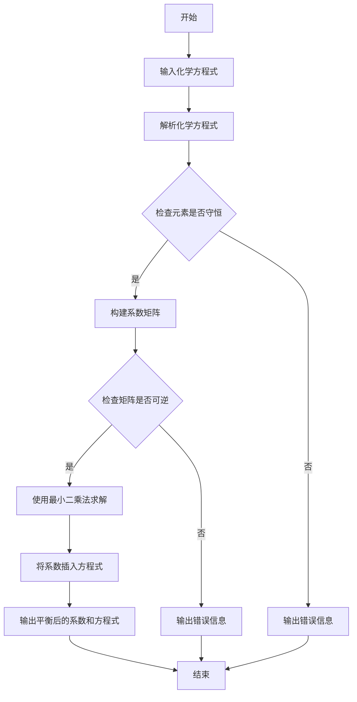

# AToCE
[English Version](README_en.md)
##### 自动配平化学方程式Automatic Trim of Chemical Equations
##### 此代码用于平衡化学方程式，并输出平衡后的系数和方程式。

##### 用户需要输入一个化学方程式，例如：Fe2(SO4)3+NH4OH=Fe(OH)3+(NH4)2SO4。

##### 代码将解析方程式，并使用线性代数方法找到平衡系数。

##### 最后，代码将输出平衡后的化学方程式。

##### 当然这个程序也会检查输入的化学方程式是否合规。
##### 1.3版本更新，优化了validate函数，仅保留检查元素不守恒的相应代码，剩余的检查用最小二乘法是否能输出结果的方法


# 1.3版本流程图Version 1.3 Flowchart



# 构建相关化学方程式的不定方程
对于一个形如：
$$
 {\textstyle \sum_{i=1}^{n}x_{i}A_{i}(p)}=  {\textstyle \sum_{j=1}^{m}y_{j}B_{j}(q)} (*)
$$
$其中A_{i}(p),B_{j}(q)代表化学式，x_{i},y_{j} 为系数$的化学方程式(*)
不妨构建以下矩阵：

$$
Matrix(A)=\begin{bmatrix}
 \left | A_{11} \right |  & \cdot \cdot \cdot & \left | A_{1n} \right |  & -\left|B_{11}\right | & \cdot \cdot \cdot  & -\left|B_{1m}\right |\\
 \left | A_{21} \right |& \cdot \cdot \cdot & \cdot \cdot \cdot  & \cdot \cdot \cdot & \cdot \cdot \cdot &  -\left|B_{2m}\right | \\
\cdot \cdot \cdot &&&&&\cdot \cdot \cdot \\
 \left | A_{(c-1)1} \right | & \cdot \cdot \cdot & \cdot \cdot \cdot  & \cdot \cdot \cdot  & \cdot \cdot \cdot &  -\left|B_{(c-1)m}\right | \\
 \left | A_{c1} \right |  & \cdot \cdot \cdot & \left | A_{cn} \right |  & -\left|B_{c1}\right | & \cdot \cdot \cdot  & -\left|B_{cm}\right |
\end{bmatrix}
 $$
 $其中\left|Q_{ij}\right |代表Q（）这个化学式中第i个已出现的元素的次数，i代表化学方程式(*)中已出现元素的排序，j代表化学方程式(*)中化合物的排序$
以及
$$
Matrix(B)=\begin{bmatrix}
 0\\
 \cdot \\
 \cdot \\
 \cdot \\
0
\end{bmatrix},Matrix(x)=\begin{bmatrix}
 x_{1}\\
 \cdot \\
 x_{n} \\
 y_{1} \\
\cdot \\
y_{m}
\end{bmatrix}
$$
于是解不定方程Matrix(**A**)Matrix(*x*)=Matrix(**B**)即可。需要注意的是，这个不定方程中常数矩阵**B**皆为0，用最小二乘法去拟合会得到x等于一个零向量。那么必须先在系数矩阵**A**找到非零次数最少的那列，移到常数矩阵**B**中，这样才可以用最小二乘法解这个不定方程。

举个例子，化学方程式$x_{1}CH_{3}COOH=x_{2}CO_{2}+x_{3}H_{2}O$的系数矩阵**A**为：$\begin{bmatrix}'C': & 2 & -1 & 0\\'H': & 4 & 0  & -2\\'O': & 2 & -2 & -1\end{bmatrix}$（：前面的仅作演示说明）
此时提取第一列有系数矩阵**A_new**$\begin{bmatrix}   -1 & 0\\ 0 & -2\\  -2 & -1\end{bmatrix}$. 常数矩阵**B**$\begin{bmatrix} -2\\-4\\-2\end{bmatrix}$.此时才可以运算。

# 功能

```markdown
## 待办事项

- [ ] 自动配平离子反应方程式
  - [ ] 识别右上角标符号 
  - [ ] 计入配平计算 或 直接配平后检验
- [ ] 多次输入并配平

## 已完成
- [x] 识别基本化学方程式
- [x] 实现配平逻辑算法
- [x] 识别()并计入运算
- [x] 书写检查
```

# 使用
有python环境下.../AToCE-1.3.py
无python环境下.../dist/AToCE-1.3.exe
